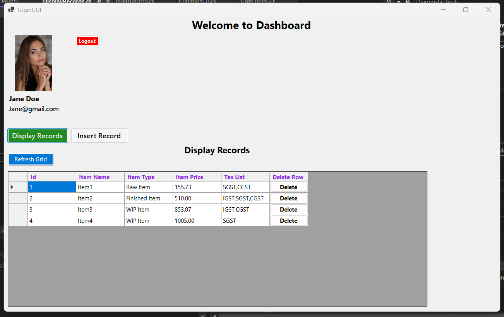
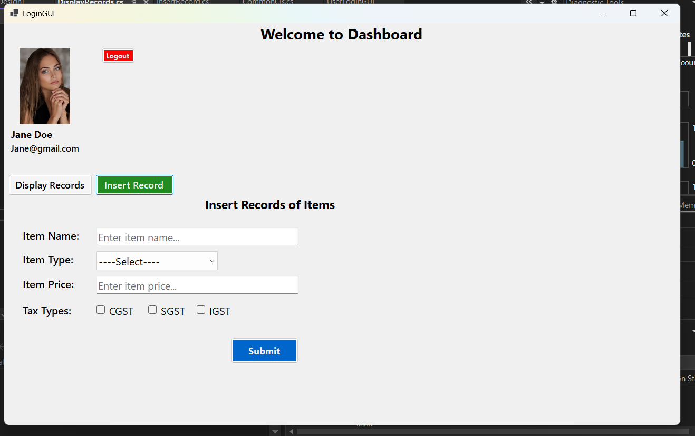

```UserLoginGUI``` is the main project where Winform application is created. ```UserLoginGUI_ApiEndpoints``` is separate project, which contains a class file which contains https Api endpoints as a property value.
The ```UserLoginGUI_ApiEndpoints``` is added to ```UserLoginGUI``` to access all those endpoints for http request through HttpClient(). 
The below is two image samples of how the app will looks like after successful login.


1.```Displaying records```

You can also delete rows from here.


2.```Insert form```

